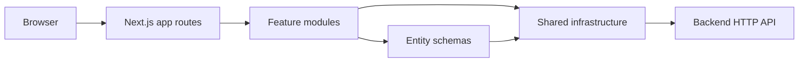
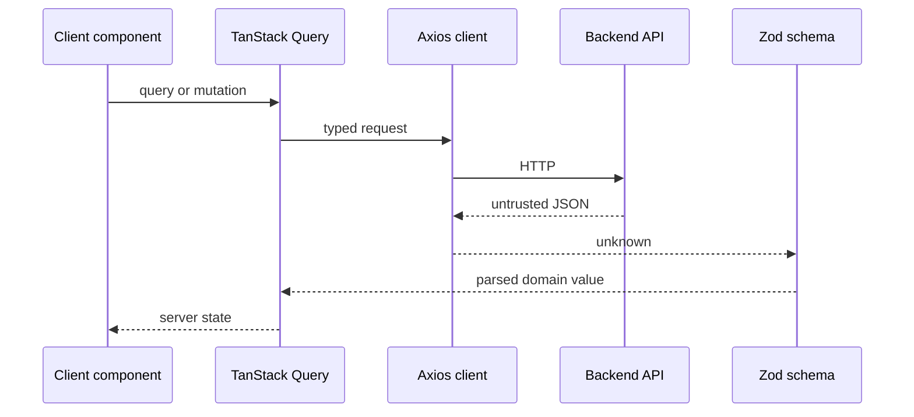

# System Overview

Mannamap frontend는 Next.js App Router 애플리케이션입니다. 서버 컴포넌트가 기본이며 상호작용, React Hook Form, TanStack Query가 필요한 경계만 클라이언트 컴포넌트로 선언합니다. 백엔드 HTTP API는 현재 유일하게 확인된 외부 시스템입니다.



# Module Boundaries

- `src/app`: URL, metadata, layout, provider, feature 조합
- `src/features`: 로그인, 사용자 조회, 장소 검색처럼 사용자가 수행하는 행동
- `src/entities`: 여러 기능에서 재사용하는 도메인 타입과 런타임 스키마
- `src/shared`: HTTP client, 환경 설정, 범용 UI처럼 도메인을 모르는 코드

세부 규칙과 위반 예시는 [boundaries](docs/architecture/boundaries.md)에 있습니다.

# Dependency Direction

```text
app -> features -> entities -> shared
```

상위 레이어는 하위 레이어를 사용할 수 있습니다. `feature -> app`, `shared -> feature`, 서로 다른 `feature -> feature` 의존은 금지되며 `pnpm architecture`가 이를 검사합니다.

# Data Flow



# Entry Points

- `src/app/layout.tsx`: HTML shell, metadata, development-only React tooling
- `src/app/providers.tsx`: client-side application providers
- `src/app/page.tsx`: `/`
- `src/app/login/page.tsx`: `/login`
- `src/shared/api/httpClient.ts`: backend HTTP boundary
- `scripts/verify`: complete local verification entrypoint

# External Systems

- Backend API: `NEXT_PUBLIC_API_BASE_URL`, default `http://localhost:8080`
- Google Fonts: Next.js font pipeline에서 Geist를 빌드 시 가져옵니다.
- React development tools: development 환경에서만 unpkg 스크립트를 로드합니다.

인증 방식, 배포 대상, 지도 공급자, 관측 플랫폼은 아직 저장소에서 확인되지 않았으며 확정 전까지 추측하지 않습니다.
